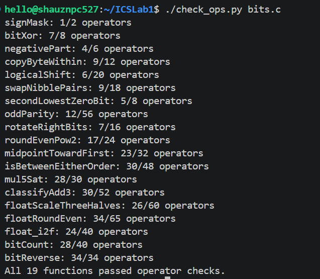
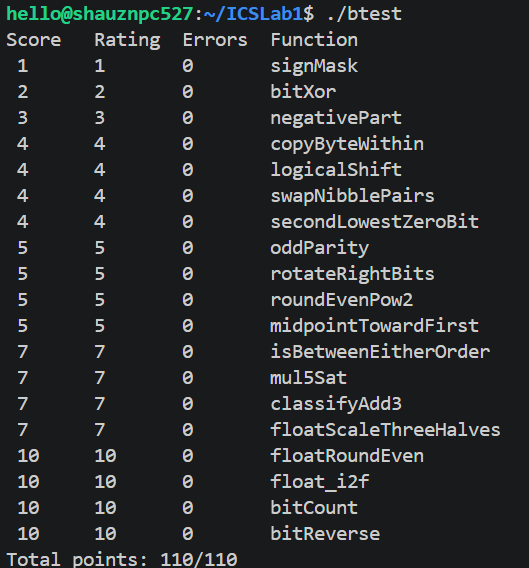

# CS:APP Data Lab 实验报告

- **姓名**：许京
- **学号**：25303060049

---

## 1. 测试结果

### 1.1 运算符与操作数检查 `./check_ops.py bits.c`

### 1.2 正确性测试 `./btest`

---

## 2. 各函数实现思路

### P1 `signMask`
返回只有最高位为 1 的掩码 `0x80000000`。直接把 `1` 左移 31 位即可：`1 << 31`。

### P2 `bitXor`
只用 `~` 和 `&` 实现异或。利用恒等式 `x^y = (x|y) & ~(x&y)`，再结合德摩根律 `x|y = ~(~x & ~y)`，得到
`(~(x&y)) & (~(~x&~y))`。

### P3 `negativePart`
当 `x < 0` 时返回 `-x`，否则返回 0。`x >> 31`（算术右移）在 `x` 为负时得到全 1（`0xFFFFFFFF`），非负时得到全 0，作为掩码；`~x + 1` 是 `-x` 的补码。两者相与：负数时保留 `-x`，非负时结果为 0。

### P4 `copyByteWithin`
把 `x` 的第 `src` 字节复制到第 `dst` 字节，其余字节不变。先把 `src`、`dst` 各左移 3 位得到位偏移；用 `~ (0xff << dst)` 清除目标字节，再用 `(x >> src) & 0xff` 取出源字节、左移到目标位置，最后按位或合并。

### P5 `logicalShift`
实现逻辑右移。`x >> n` 本身是算术右移，会做符号扩展，需要把高 `n` 位清 0。构造掩码 `~(1<<31>>n<<1)`：`1<<31>>n` 得到高 `n+1` 位全 1，左移 1 位后高 `n` 位为 1，取反即得低 `32-n` 位为 1 的掩码；最后 `x>>n & 掩码` 清除符号扩展位。

### P6 `swapNibblePairs`
交换每个字节内的高 4 位与低 4 位。先用 `mask = 0x0f | 0x0f<<8 | 0x0f<<16` 提取各字节的低半字节；`(x&mask)<<4` 把低半字节移到高半字节，`x>>4&mask` 把高半字节移到低半字节，两者相或完成交换。

### P7 `secondLowestZeroBit`
返回标记 x 的第二个最低 0 位位置的掩码。`y = x | (x+1)` 会把最低的那个 0 位变为 1；此时 `y` 的最低 0 位正是原 `x` 的第二个 0 位，再用经典的 `~y & (y+1)` 提取最低 0 位即可。

### P8 `oddParity`
返回奇校验位：1 的个数为偶数时返回 1，否则返回 0。连续执行 `x = x^(x>>16)`、`>>8`、`>>4`、`>>2`、`>>1`，把 32 位的奇偶性逐级折叠到最低位，最后 `!(x&1)` 取反得到「1 的个数为偶」这一条件。

### P9 `rotateRightBits`
循环右移 `n` 位。右移部分 `x>>n` 是算术右移，用 `&~mask`（`mask = 1<<31>>n<<1`）清掉符号扩展位；左移部分需要把低 `n` 位移到高位，移位量为 `32-n`，即 `x << (33 + ~n)`（利用 `~n = -n-1`）。两部分相或。

### P10 `roundEvenPow2`
把非负 `x` 舍入到最近的 `2^n` 倍数，恰在中点时选择商为偶数的那个。把 `x` 拆成 `multiple`（`2^n` 的整数倍部分）和 `remainder`（余数）。`remainder` 大于 `half = 2^(n-1)` 时进位；等于 `half` 时看商 `multiple>>n` 是否为奇数，奇数才进位；最终 `multiple + (sign<<n)`。

### P11 `midpointTowardFirst`
不溢出地求 `(x+y)/2`，结果恰在两整数中间时取更靠近 `x` 的那个。分别计算 `x>>1`、`y>>1`，保存各自最低位 `xBit`、`yBit` 与符号位；通过符号位与差值符号判断 `x`、`y` 的大小关系，据此决定最低位相加时的进位 `carry` 与向 `x` 靠拢的修正 `plus`。

### P12 `isBetweenEitherOrder`
判断 `x` 是否落在以 `a`、`b` 为端点的闭区间内（端点顺序任意）。分别比较 `x` 与 `a`、`x` 与 `b` 的大小：先比较符号位，符号不同时直接由符号判断，符号相同时比较 `x+~a+1`、`x+~b+1` 差值的符号。再综合两个方向的大小关系，并处理 `x` 等于端点的情况。

### P13 `mul5Sat`
返回 `x*5`，溢出时饱和到 `INT_MAX` 或 `INT_MIN`。先算 `y = x + (x<<2) = 5x`（低 32 位，溢出时回绕）。判断溢出：`INT_MAX/5 = 0x19999999`，用 `t = 0x19999999` 与 `x`（或 `-x`）相加后的符号位判断是否超过正/负阈值；分别得到 `posOv`、`negOv`，再据此选择 `MAX`、`MIN` 或正常结果 `y`。

### P14 `classifyAdd3`
判断 `x+y+z` 的精确和相对 `INT_MAX`、`INT_MIN` 的位置，返回 1 / -1 / 0。分两步相加：`s12 = x+y`、`s = s12+z`。每一步记录本次相加是否发生「正溢出方向的进位」`c1`、`c2`：两个正数相加得负（`~xs&~ys&s12s`）或两个负数相加得正（`xs&ys&~s12s`）。两步的进位方向之和 `k = c1 + c2`，若 `k` 非零则和溢出，方向由 `k` 的符号给出（`(k>>31)|(!!k)` 得到 1 或 -1）；`k == 0` 返回 0。

### P15 `floatScaleThreeHalves`
返回浮点数 `f * 1.5` 的位级表示。拆出符号、阶码、尾数。阶码为 `0xFF`（NaN/Inf）时原样返回；`exp == 0`（0 或非规格化数）时，0 保留符号原样返回，非规格化数对尾数乘 3、右移 1 位并做向偶舍入，若进位到 `2^23` 则提升为规格化数；规格化数取 24 位有效数 `sig = 0x800000|frac`，同样乘 3 右移 1 位向偶舍入，若有效数溢出到 25 位则再舍入并让阶码加 1，阶码到达 `0xFF` 时溢出为无穷大。

### P16 `floatRoundEven`
把浮点数舍入到最近整数，中点向偶舍入，返回结果的位级表示。NaN/Inf 原样返回；`exp == 0`（绝对值小于 `2^-126`）舍入到带符号的 0（负数返回 `-0`）；`exp >= 150`（绝对值 ≥ `2^23`）本身已是整数，原样返回。否则取 24 位有效数 `M`，令 `s = 150 - exp`，把 `M` 右移 `s` 位得到整数部分 `ip`，低位 `low = M & ((1<<s)-1)` 与 `half = 1<<(s-1)` 比较：`low > half` 或 `low == half` 且 `ip` 为奇数时进位。舍入结果为 0 时返回带符号的 0，否则把 `R` 重新规范化（用循环确定最高位位置得到阶码 `127+sh`，并把尾数左移对齐）写回。

### P17 `float_i2f`
把 `int` 转成单精度浮点的位级表示。取符号位 `sign = x & 0x80000000`；`x == 0` 直接返回 0；负数取绝对值 `mag = ~x+1`（`INT_MIN` 时回绕成 `0x80000000`，正好是 2³¹，处理正确）。把 `mag` 循环左移到最高位对齐，得到阶码 `exp = 158 - shift`；取 `frac = (mag>>8) & 0x7FFFFF` 为 23 位尾数，低 8 位 `rem` 作为舍入位：`rem > 0x80` 或 `rem == 0x80` 且尾数为奇数时向偶进位；若进位后尾数产生第 24 位，则尾数清零、阶码加 1。最后组合符号、阶码、尾数。

### P18 `bitCount`
统计 `x` 中 1 的个数。采用分治法：先用 `m1 = 0x55555555` 把相邻 2 位各自计数相加，再用 `m2 = 0x33333333` 把每 4 位相加，依次用 `m3 = 0x0F0F0F0F`（每 8 位）、`m4 = 0x00FF00FF`（每 16 位）、`m5 = 0x0000FFFF`（整体）逐级合并，最后得到 1 的总个数。

### P19 `bitReverse`
反转 32 位整数的所有位。采用 5 级 butterfly 交换：依次交换相邻 1 位、2 位、4 位、8 位、16 位。为压缩操作数，掩码用 XOR 链式推导：`m4 = 0x00FF00FF`，`m3 = m4^(m4<<4) = 0x0F0F0F0F`，`m2 = m3^(m3<<2) = 0x33333333`，`m1 = m2^(m2<<1) = 0x55555555`，`m5 = 0x0000FFFF`。最后一步 16 位交换用 `(x<<16) | ((x>>16)&m5)`，用 `&m5` 屏蔽算术右移的符号扩展，保证结果正确，最终恰好 34 个操作符。
